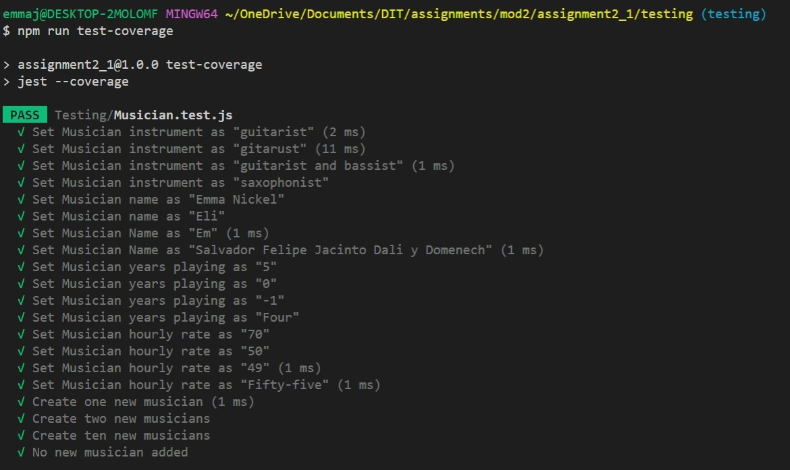
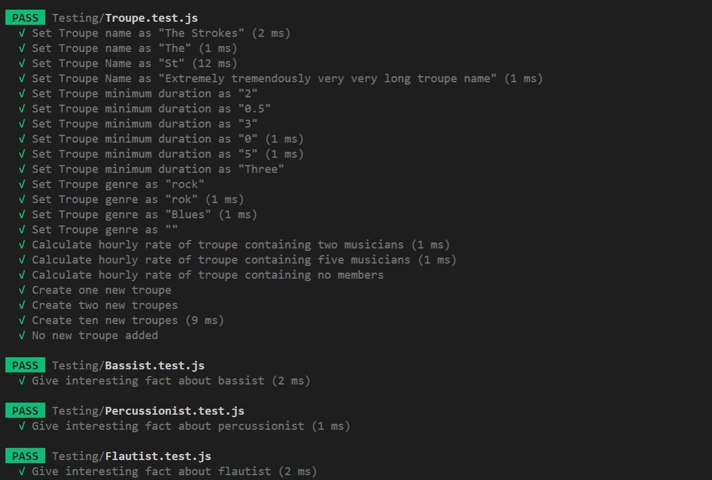
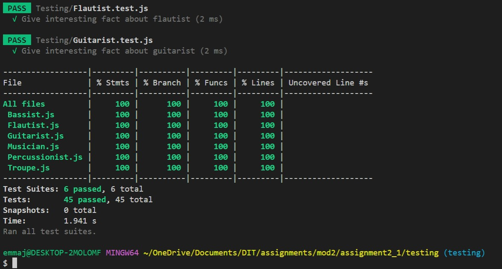

# Test Progress Report

### Emma Nickel

 

## Manual Testing Results

The following five manual unit tests were conducted on the MusoPlan software to ensure the subsystems within the program interact cohesively as a whole.

 

## Unit Test 1: Create a musician

**Testing instructions:**

1. Select option 1 from the main menu by pressing 1.
2. Select the instrument the musician plays by typing one of the following 4 instruments: guitarist, bassist, percussionist or flautist.
3. Enter the musician's name (must be between 3 and 30 characters in length).
4. Enter the number of years the musician has been playing (as a non-negative number).
5. Enter the musician's hourly rate (as a number greater than or equal to 50).

 

| Input | Expected output | Actual Output |
|---|---|---|
| `'1'`   `->'guitarist'`   `->'Emma Nickel'`   `->'7'`   `->'65'` | `'You have successfully created a musician.'` | `'You have successfully created a musician.'` | 
| `'1'`   `->'pianist'` | `'Invalid input. Instrument must be either guitarist, bassist, percussionist or flautist.'` | `'Invalid input. Instrument must be either guitarist, bassist, percussionist or flautist.'` |
| `'1'`   `->'guitarist'`   `->'Em'` | `'Invalid input. Musician name must be between 3 and 30 characters.'` | `'Invalid input. Musician name must be between 3 and 30 characters.'` |
| `'1'`   `->'guitarist'`   `->'Emma Nickel'`   `->'-4'` | `'Invalid input. Years playing must be a non-negative integer.'` |  `'Invalid input. Years playing must be a non-negative integer.'` |
| `'1'`   `->'guitarist'`   `->'Emma Nickel'`   `->'7'`  `->'40'` | `'Invalid input. Hourly rate must be a number greater than 50.'` |  `'Invalid input. Hourly rate must be a number greater than 50.'` |

*Test conducted at 12pm AEST on 10/08/22*
 
 

## Unit Test 2: Create a troupe

**Testing instructions:**

1. Select option 2 from the main menu by pressing 2.
2. Enter the troupe's name (must be between 3 and 30 characters in length).
4. Enter the troupe's minimum duration in hours (as a number between 0.5 and 3).
5. Enter the troupe's genre by typing one of the following: rock, jazz or pop.

 

| Input | Expected output | Actual Output |
|---|---|---|
| `'2'`   `->'The Strokes'`   `->'2.25'`   `->'rock'` | `'You have successfully created a troupe.'` |`'You have successfully created a troupe.'` | 
| `'two'` | `'Invalid input. Selection must be a number between 1-9.'` | `'Invalid input. Selection must be a number between 1-9.'` |
| `'2'`   `->'The Strokes'`   `->'5'` | `'Invalid input. Minimum duration between 0.5 and 3 hours.'` | `'Invalid input. Minimum duration between 0.5 and 3 hours.'` |
| `'2'`   `->'The Strokes'`   `->'2.25'`   `->'country'` | `'Invalid input. Genre must be either rock, jazz or pop.'` |  `'Invalid input. Genre must be either rock, jazz or pop.'` |

*Test conducted at 12pm AEST on 10/08/22*
 
 

## Unit Test 3: Add a musician to a troupe

**Testing instructions:**

1. Select option 3 from the main menu by pressing 3.
2. Enter the musician's name chosen from the given list.
4. Enter the troupe's name chosen from the given list.

 

| Input | Expected output | Actual Output |
|---|---|---|
| `'3'`   `->'Emma Nickel'`   `->'The Strokes'`  | `'Successfully added Emma Nickel to the strokes.'` |`'Successfully added emma to the strokes.'` | 
| `'3'`   `->'Non-existent musician'`| `'Invalid selection. Please enter an existing musician name.'` |`'Invalid selection. Please enter an existing musician name.'` |
| `'3'`   `->'Emma Nickel'`   `->'Non-existent troupe'` | `'Invalid selection. Please enter an existing troupe name.'` |`'Invalid selection. Please enter an existing troupe name.'` |
| `'3'`   `->'Jack'`   `->'The Strokes'`   (6th member addition) | `'This troupe is full. Please select another troupe.'` |`'This troupe is full. Please select another troupe.'` | 
| `'3'`   `->'Emma Nickel'`   `->'The Strokes'`   (Repeat addition) | `'Emma Nickel is already a member of The Strokes. Please select another musician.'` |`'Emma Nickel is already a member of The Strokes. Please select another musician.'` | 

*Test conducted at 12pm AEST on 10/08/22*
 
 

## Unit Test 4: Provide a summary description of a troupe

**Testing instructions:**

1. Select option 4 from the main menu by pressing 4.
2. Enter the selected troupe's name chosen from the given list.

 

| Input | Expected output | Actual Output |
|---|---|---|
| `'4'`   `->'The Strokes'` |`'Summary Description`   `==============================`   `Troupe name: The Strokes`   `==============================`   `Members: `   `- Emma Nickel`   `Instruments:`   `- Guitarists: 1`  `- Bassists: 0`   `- Percussionists: 0`   `- Flautists: 0`   `Genre: rock`   `Minimum duration: 2.25 hours`   `Hourly rate: $65/hr'`|`'Summary Description`   `==============================`   `Troupe name: The Strokes`   `==============================`   `Members: `   `- Emma Nickel`   `Instruments:`   `- Guitarists: 1`  `- Bassists: 0`   `- Percussionists: 0`   `- Flautists: 0`   `Genre: rock`   `Minimum duration: 2.25 hours`   `Hourly rate: $65/hr'` | 
| `'4'`   `->'Non-existent troupe'` | `'Invalid selection. Please try again.'` |`'Invalid selection. Please try again.'`|
| `'4'`   `->'MGMT'`   (Troupe containing no members) | `'Summary Description `   `==============================`   `Troupe name: MGMT`   `==============================`   `Members: None`   `Genre: rock`   `Minimum duration: 2 hours`   `Hourly rate: $0/hr'` | `'Summary Description `   `==============================`   `Troupe name: MGMT`   `==============================`   `Members: None`   `Genre: rock`   `Minimum duration: 2 hours`   `Hourly rate: $0/hr'` | 

*Test conducted at 12pm AEST on 10/08/22*
 
 

## Unit Test 5: Calculate the cost of deploying the troupe for a number of hours

**Testing instructions:**

1. Select option 6 from the main menu by pressing 6.
2. Enter the selected troupe's name chosen from the given list.
3. Enter the selected number of hours to deploy the troupe (as a number between the troupe's minimum duration and 3).

 

| Input | Expected output | Actual Output |
|---|---|---|
| `'6'`   `->'The Strokes'`   `->3`   | `'Cost of deployment of the strokes for 3 hours is: $195.'` |`'Cost of deployment of the strokes for 3 hours is: $195.'` |
| `'6'`   `->'The Strokes'`   `->4` | `'Invalid number of hours. Please give a number of hours between 2.25 and 3.' ` | `'Invalid number of hours. Please give a number of hours between 2.25 and 3.' `| 

*Test conducted at 12pm AEST on 10/08/22*
 
 

## Automated Testing Results

The automated tests outlined in the test plan were undertaken using the Jest framework. As can be observed in the following screenshots, the MusoPlan software has 100% coverage of functions tested by automated testing.

## Appendix
[JUnit xml document](../../junit.xml) of the automated testing results.
 

[Formatted coverage report](../../coverage/lcov-report/index.html) of the automated testing results (open with Live Server).
